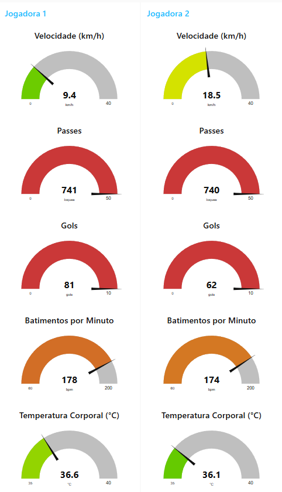
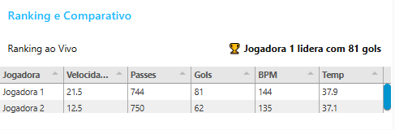

# **Projeto de Edge Computing & IoT**

---

## 👩‍💻 Integrantes

- [Alana Vieira Batista | Felippe Nascimento Silva | Gabriel S. Hemeterio | Kawan Oliveira Amorim | Matheus Hideki Doroszewski Yoshimura]
- RMs: [xxxxxx | 562123 | 566243 | xxxxxx | 564970]

---

## 🎯 Objetivo do Projeto

O Woman United é uma plataforma de monitoramento esportivo em tempo real, desenvolvida como uma solução IoT voltada à valorização do futebol feminino. Por meio de dispositivos simulados com ESP32, o sistema coleta dados de desempenho das jogadoras e os transmite via protocolo MQTT para uma infraestrutura central baseada em Node-RED.
A aplicação tem como objetivo promover visibilidade e análise técnica acessível para atletas mulheres, oferecendo indicadores como velocidade, passes, gols, frequência cardíaca e temperatura corporal. A proposta busca não apenas democratizar o uso de tecnologia no esporte, mas também contribuir para a equidade e reconhecimento no cenário esportivo feminino, onde o acesso a dados e estatísticas ainda é limitado.

---

## 🌐 Arquitetura da Solução

```plaintext
          [ESP32 - Jogadora 1]                         [Broker HiveMQ]                          [Node-RED]                          [Dashboard]
     Envia dados via MQTT JSON -->       Publish/Subscribe (topic: jogadora1)     -->     Recepção + Processamento     -->     Gauges, Tabela, Ranking

          [ESP32 - Jogadora 2]                         [Broker HiveMQ]                          [Node-RED]                          [Dashboard]
     Envia dados via MQTT JSON -->       Publish/Subscribe (topic: jogadora2)     -->     Recepção + Processamento     -->     Gauges, Tabela, Ranking
```

- Dispositivos simulados: **ESP32 (Wokwi)**
- Protocolo: **MQTT**
- Broker: **HiveMQ** (`broker.hivemq.com`)
- Interface: **Node-RED Dashboard**

---

## 📊 Dados Coletados

Cada jogadora envia os seguintes dados a cada 5 segundos:

- `velocidade`: Velocidade média da jogadora (float, km/h)
- `passes`: Total de passes realizados
- `gols`: Número de gols
- `bpm`: Batimentos por minuto
- `temp`: Temperatura corporal (°C)

---

## 🧠 Funcionalidades Implementadas

- ✅ Dashboard em tempo real com gauges para **cada jogadora**
- ✅ **Ranking ao vivo** baseado na quantidade de gols
- ✅ **Tabela comparativa** com todos os dados lado a lado
- ✅ Separação modular dos fluxos por jogadora
- ✅ Atualização automática da tabela e ranking
- ✅ Simulação 100% funcional via Wokwi e Node-RED local

---

## 🛠️ Tecnologias Utilizadas

| Tecnologia      | Papel no Projeto                              |
|------------------|-----------------------------------------------|
| **ESP32 (Wokwi)** | Dispositivo simulador IoT (publicador MQTT)   |
| **HiveMQ**       | Broker MQTT público (pub/sub)                 |
| **MQTT**         | Protocolo leve para transmissão de dados      |
| **Node-RED**     | Plataforma de integração e dashboard visual   |
| **Node-RED Dashboard** | Interface para visualização em tempo real |
| **JSON**         | Formato de mensagem transmitida               |

---

## 🚀 Como Executar o Projeto

### 1. Simulação no Wokwi

- Abra o link do projeto no Wokwi (Jogadora 1 e Jogadora 2):
  - 🔗 [Jogadora 1](https://wokwi.com/projects/442104011528630273)
  - 🔗 [Jogadora 2](https://wokwi.com/projects/442104624636305409)

- Pressione **Play** para iniciar o envio dos dados via MQTT

### 2. Executar o Node-RED

- Instale o Node-RED localmente:
```bash
npm install -g node-red
node-red
```

- Acesse o fluxo via navegador: [http://localhost:1880](http://localhost:1880)

- Vá em Menu ☰ → Importar → Cole o conteúdo do `flow.json` ou use o botão de upload

### 3. Visualizar Dashboard

- Acesse o painel interativo:
  👉 [http://localhost:1880/ui](http://localhost:1880/ui)

---

## 📂 Estrutura do Repositório

```
.
├── flow.json                     # Flow completo do Node-RED com jogadora 1 e 2
├── jogadora1.ino                 # Código Wokwi ESP32 – Jogadora 1
├── jogadora2.ino                 # Código Wokwi ESP32 – Jogadora 2
├── README.md                     # Este arquivo
└── assets/
    └── Arquitetura-Diagrama.png          
```

---

## 📌 Observações Finais

-O projeto foi concebido com foco em eficiência, simplicidade e escalabilidade, utilizando apenas tecnologias leves e de fácil integração (ESP32, MQTT, Node-RED).

-A simulação pode ser facilmente adaptada para um cenário real, conectando sensores físicos e vestíveis para coleta de dados em campo.

-O painel foi estruturado de forma modular e visualmente intuitiva, permitindo expansão futura com novas métricas ou integração com bancos de dados, alertas inteligentes e exportação de relatórios.

---

## 🎬 Vídeo Demonstrativo

📺 [Assista ao vídeo explicativo no YouTube](x)

## 📸 Prints da Dashboard




---
